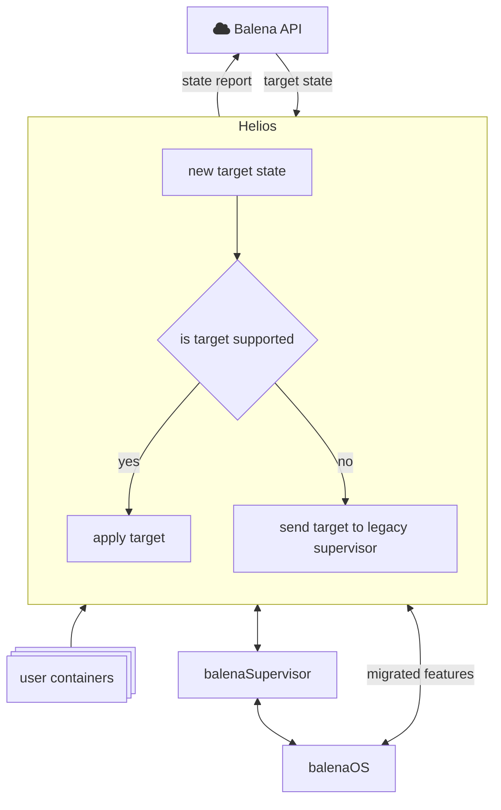
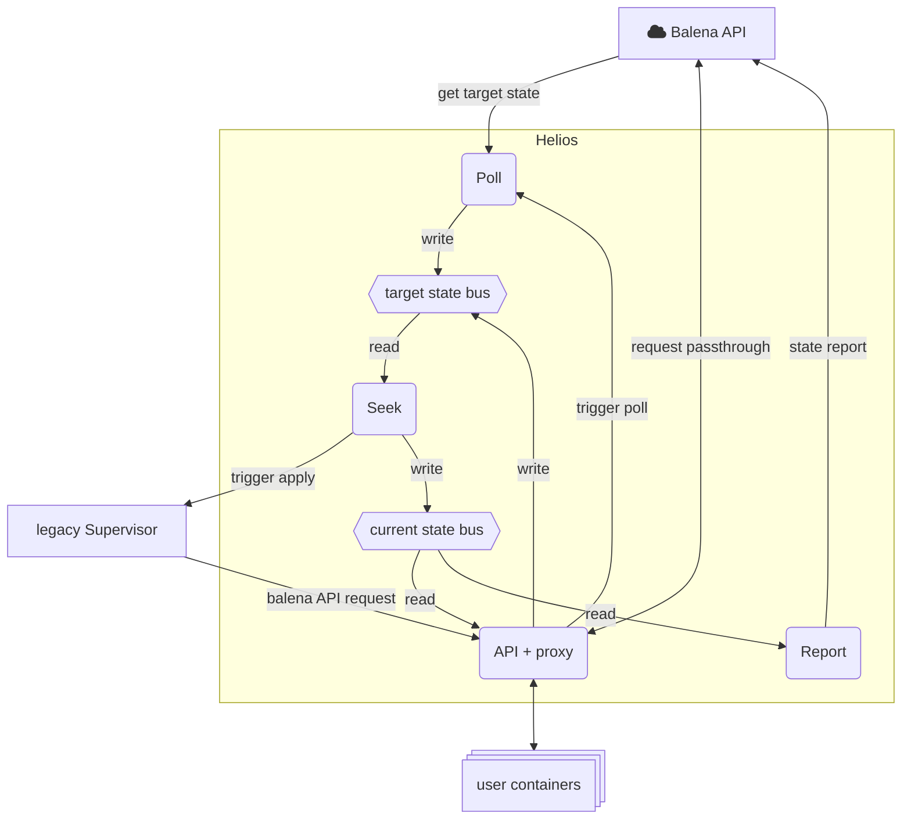

# helios

[Balena's](https://www.balena.io/) on-device agent. The service is responsible for performing app updates, configuring the host system and generally monitoring and keeping the host and apps healthy.

Helios is designed to run in a diversity of environments and continue operating autonomously with little to no human input.

This project is an experimental replacement for the current [balenaSupervisor](https://github.com/balena-os/balena-supervisor), implementing a [strangler fig](https://martinfowler.com/bliki/StranglerFigApplication.html) / [ship of Theseus](https://understandlegacycode.com/blog/ship-of-theseus-avoid-rewrite-legacy-system/) approach for taking over the features of that service. When started, Helios reconfigures the existing supervisor becoming a proxy for all communications between the legacy service and the Balena API and user containers. This means Helios can choose which requests get passed to the legacy supervisor and which it can handle by itself, progressively replacing it without losing access to any existing features.

## Motivation

The device agent is the core component for release and configuration management on Balena-enabled user devices. The existing balenaSupervisor grew organically according to new requirements that came in, this was expected in early stages of the company, where the product shape was unclear and we needed to prioritize fast turnaround over long term architecture. The existing service is resource heavy (written in NodeJS) and its interfaces are not clearly defined, making it tightly coupled with balenaOS and the balenaCloud product. In the spirit of enablement, we want the device agent to be able to be able to operating under different scenarios and configurations. This project allows to move forward with a clean architecture and progressively build a lightweight replacement for the supervisor that is also well aligned with the needs of Balena's users going forward.

## Goals

These are the key desired features that guide the development of this project.

- Self-configuring. When started, the service determines the capabilities of the host enviroment and available interfaces (e.g. container engine, D-Bus, OTA, etc.) and adapts its behavior to apply the remote target state within the given capabilities.
- Fault tolerant. The service can recover from failures and resume operations without human intervention.
- Self-healing. The service continuously monitors the system and perform corrective measures to ensure system health and keep the system on-target.
- Observable. The service state and its decisions can be determined from the system logs.

## Quickstart

### Using an existing UUID/API key

If you already have a valid UUID and device API key for balenaCloud (eg. from a [pre-registered device](https://docs.balena.io/learn/more/masterclasses/advanced-cli/#52-preregistering-a-device)) you can start Helios as follows and it will assume the given device identity:

```
cargo run -- \
    --remote-api-endpoint https://api.balena-cloud.com \
    --remote-api-key <device-api-key> \
    --uuid <device-uuid>
```

### Registering as a new device

Alternatively, you can have helios register a new unique identity with balenaCloud. To do so, follow these steps:

- Visit balenaCloud Dashboard at https://dashboard.balena-cloud.com/ and login.

- Create a new fleet choosing "Generic AARCH64" for device type (slug: "generic-aarch64"). You may choose any device type you want, but make sure you know its slug as you'll have a hard time finding it on the Dashboard.

- Get the fleet ID from the URL in the browser's address bar.

- Go to Provisioning Keys from the left sidebar and create a new one. Make sure to copy its value when shown. If you miss it, just make a new provisioning key.

- We now have the values we need:

  - The ID of the fleet to provision the device into
  - The device type of this fleet
  - A provisioning key for this fleet

- With those, you can start Helios with:

```
cargo run -- \
    --remote-api-endpoint https://api.balena-cloud.com \
    --provisioning-fleet <fleet-id> \
    --provisioning-device-type generic-aarch64 \
    --provisioning-key <provisioning-key>
```

For the full list of command line arguments use `cargo run -- --help`

Helios will register with the remote and the device will appear on the Dashboard. The next time you start helios, you do not need to provide these arguments again (though it is not an error if you do; they are just ignored) and helios will still assume the correct identity and connect with remote. This is because helios stores all necessary information into its config file after successful registration. If you want Helios to forget this identity, just delete its config file whose path helios prints when it starts.

## Architecture Overview

The new service sits between the existing balenaSupervisor and the balena API and user containers acting as a proxy for requests to the backend and legacy supervisor. On a new request:

- If the source is the old supervisor, assume that the target is the backend and proxy the request. The exception to this are requests to the target state endpoint, where Helios returns a cached (and perhaps modified) version of the target state for the legacy supervisor to install.
- If the source is different, assume the request is going to the legacy supervisor and forward the request. The exception are requests going to the /v3 API, which is implemented by Helios, and requests to the /v1/update endpoint which are also handled by Helios to trigger a new poll and target state apply.

This is also illustrated on the diagram below.



The new service is designed to be fully independent of the legacy supervisor, with the exception of the initial reconfiguration of the supervisor, Helios has an entirely different state management implementation and communicates to other services, the OS and legacy supervisor through specific interfaces.

Internally, the service has 4 main components:

- **API**: handles requests coming from other services, the legacy supervisor and the backend. A sub-component of the API is the proxy, which has been kept as a self contained module that can eventually be removed once the legacy supervisor is no longer needed. The API component can only read current state (from a shared bus) and write a target state. It can also trigger a new poll request by talking to the Poll component.
- **Poll**: handles communication with the remote backend. It requests the target state on a timer, which can be skipped when a poll trigger is received via the API ([/v1/update endpoint](https://docs.balena.io/reference/supervisor/supervisor-api/#post-v1update)). When a new target state is received, the target is placed on a shared bus where the Seek component can pick it up.
- **Seek**: is in charge of handling target state and updating the current state. The core of this component it the new planning engine, [Mahler](https://github.com/balena-io-modules/mahler-rs) which is used to calculate a new workflow to the target state and run the necessary tasks. After running, it calls the legacy supervisor to finish with any pending tasks. During the process, it updates the current state in the shared bus where the API and the Report components can read it from.
- **Report**: reads state from the current state bus and sends reports to the remote backend. Internally it keeps a copy of the last successful report to send only the differences in the state.



## Testing on a Balena device

The service can be set-up to take over the existing balena Supervisor on a running device. The service does this by becoming a proxy betweeen the existing supervisor and the Balena API and local applications. For more information see [balena-os/balena-supervisor#2422](https://github.com/balena-os/balena-supervisor/pull/2422).
